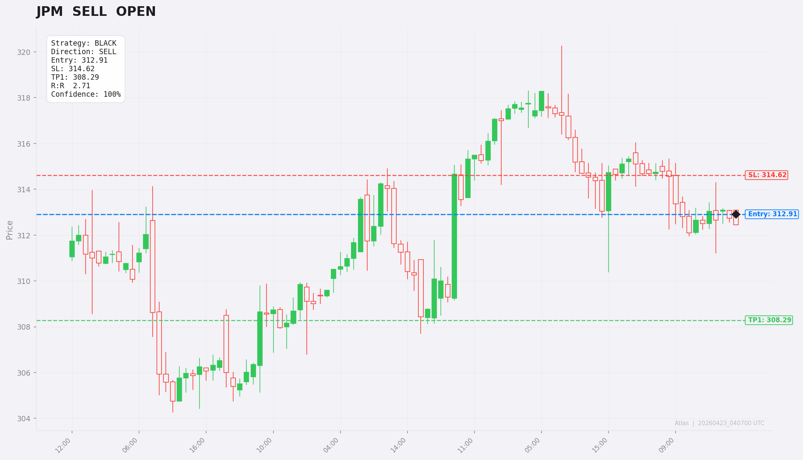
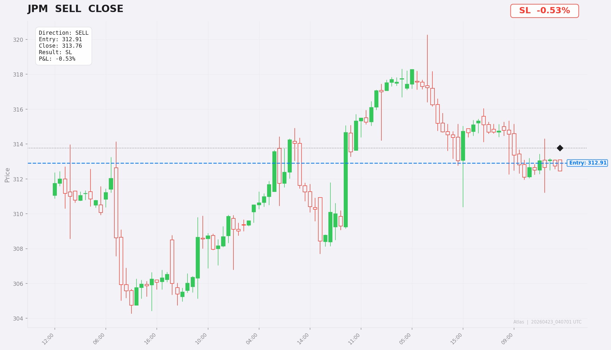
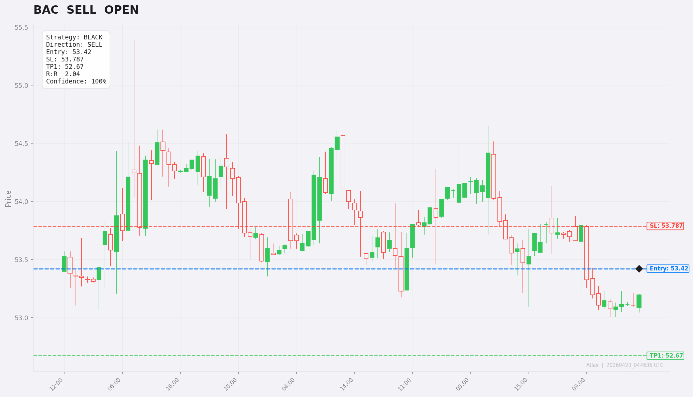

# Entregable Mentoría TradingLab — 3 Trades Reales

**Alumno:** Sergio Castellanos
**Fecha entregable:** 2026-04-23
**Capital inicial:** $190.88 USD
**Broker:** Capital.com (cuenta 314623104804541636, AUTO mode)
**Plataforma:** Atlas (app custom basada en TradingLab + Trading Plan PDF Alex Ruiz)
**Repo:** https://github.com/Seryi358/neontrade-ai
**App URL:** https://n8n-neontrade-ai.zb12wf.easypanel.host/

---

## Configuración aplicada (per Trading Plan PDF + audits 2026-04-17 y 2026-04-22)

| Parámetro | Valor | Fuente mentoría |
|---|---|---|
| trading_style | day_trading (forex/crypto/commodities) + SWING para equities | Watchlist para Acciones: "yo hago swing trading en acciones" |
| risk_day_trading | 1% (~$1.88/trade) | Ch18.3 Regla del 1% |
| risk_swing | 1% (cap conservador para <$500) | PDF pg.3: 3%; cap aplicado |
| max_trades_per_day | 3 | Day trading: quality > quantity |
| max_total_risk | 5% (cap conservador) | PDF pg.3: 7%; cap aplicado |
| be_trigger_method | pct_to_tp1 (0.50) | PDF pg.5 |
| position_management | CP (short-term, EMA M5_5 + EMA M5_2 emergency) | Alex: "salir cuanto antes" |
| swing_for_equities | True (Wkly→Daily→H1→M15 pyramid) | Audit C1: equities = SWING |
| strategies activas | 9/9 (BLUE A/B/C, RED, PINK, WHITE, BLACK, GREEN) | Mentoría completa |
| trading_hours_utc | 07:00-21:00 | London + NY sessions |
| BLUE TP1 | swing anterior, TP_max EMA 4H 50 | PDF pg.6 |
| BLACK TP | EMA 50 4H, R:R mínimo 2:1 | PDF pg.6 |
| BLACK TP_max cap | 1.5× distancia tp1 | Audit 2026-04-22: prevenir Fib 1.618 absurdo |
| EMA 8 Weekly filter | sólo crypto | CLAUDE.md gotcha |
| Equities correlation | 19 grupos sectoriales (banks/semis/airlines/...) | Audit JPM+BAC double-BLACK |
| News window | 30min antes/después (medium+ impact) | News filter mentoría |
| AutoASR (post-trade AI) | activado, GPT-4o vision | Self-improvement Phase 1 |
| TuningEngine | modo `auto`, 3 reglas SAFE (≥10 trades) | Self-improvement Phase 2 |

---

## Flujo de cada trade

1. Atlas escanea ~260 instrumentos en ciclos (forex+crypto+commodities cada 120s, scalping cada 30s)
2. Detecta setup válido → IA valida (informational only) → ejecuta orden Capital.com
3. **Gmail alert** a `scastellanos@phinodia.com` con detalles (entry/SL/TP/R:R)
4. **Screenshot OPEN** auto-generado con 100 velas + niveles + strategy
5. Posición gestionada automáticamente:
   - **INITIAL**: SL en swing extremo
   - **SL_MOVED**: 50% risk cut al primer movimiento favorable
   - **BREAK_EVEN**: SL a entrada al alcanzar 50% del camino a TP1 (mentoría pct_to_tp1=0.50)
   - **TRAILING_TO_TP1**: trail con EMA 50 M5 una vez roto el swing previo (gate de mentoría)
   - **AGGRESSIVE**: post-TP1, switch a EMA M2/M5_5 para captar máximo
6. Cierre (TP, SL, trailing, emergency EMA 2/5) → **Screenshot CLOSE** + **AutoASR** (GPT-4o evalúa contra plan, no contra resultado) + **Gmail trade_closed alert**

---

## Trade 1 — JPM SELL (BLACK)

**Fecha/hora UTC:** 2026-04-22T15:24:37 → 2026-04-22T20:02:13 (4h 38min)
**Trade ID:** `0000a40d-0001-54c4-0000-000080e40692`

| Campo | Valor |
|---|---|
| Par | JPM (JPMorgan Chase, NYSE) |
| Strategy | **BLACK** (Anticipación Contratendencia, Onda Elliott 1) |
| Direction | SELL (contratendencia vs HTF bullish) |
| Entry | $312.91 |
| SL inicial | $314.62 (encima de máximo previo) |
| TP1 | $308.29 (EMA 50 4H) |
| Size | 1.18 unidades |
| Risk | $2.00 (~1% de $190.88) |
| R:R | 2.71:1 (≥ 2.0 mínimo BLACK) |
| Resultado | **closed_sl** @ $313.76 |
| P&L | -$1.01 (-0.53% balance) |

### Por qué se ejecutó (BLACK strategy compliance)

Atlas detectó setup BLACK válido cumpliendo los 7 pasos:

1. **Nivel S/R diario** (OBLIGATORIO): JPM atacó resistencia diaria
2. **Sobrecompra/sobreventa**: HTF bullish + RSI elevado en H4
3. **Desaceleración en diario**: pattern de reversal detectado
4. **4H sobrecompra INNEGOCIABLE**: precio > 1.5% de EMA 50 4H, separación fuerte
5. **Patrón reversal en H1**: triángulo formado, EMA 50 H1 NO actúa como S/R dinámica (<3 toques)
6. **Ejecución M5**: Rompe-Cierra-Confirma (RCC) en EMA M5_50 + INSIDE_BAR_BEARISH
7. **R:R 2.71:1** > 2.0 mínimo BLACK ✓

**Confianza final:** 100% (HTF score 75 + confluence +5 puntos)
**Sesgo HTF:** ALCISTA → SELL contra-tendencia (esperado en BLACK, no contradicción)

### Análisis post-mortem AutoASR (GPT-4o)

> "Es importante revisar si se siguieron todos los pasos del plan de trading, independientemente del resultado."

Resultado: SL hit por mean-reversion intradía. La gestión 50%-half-risk movió SL de $314.62 → $313.76 al primer dip a $311.22 (correcto per plan), pero el rebote subsecuente lo tagged. Es el modo de fallo conocido del trailing tight en mercado lateral. **Ejecución correcta per plan; resultado adverso por probabilidad.**

### Screenshots

**OPEN:**

**CLOSE:**

---

## Trade 2 — BAC SELL (BLACK) — Aún abierta en BREAK_EVEN

**Fecha/hora UTC:** 2026-04-22T14:24:15 (abierta hace ~13h, sigue activa)
**Trade ID:** `00002043-0001-54c4-0000-000080e404b8`

| Campo | Valor |
|---|---|
| Par | BAC (Bank of America, NYSE) |
| Strategy | **BLACK** (Anticipación Contratendencia) |
| Direction | SELL (contratendencia vs HTF bullish) |
| Entry | $53.42 |
| SL inicial | $53.787 (encima máximo previo) |
| SL actual | **$53.42** (movido a BE — mentoría) |
| TP1 | $52.67 (EMA 50 4H con offset 93%) |
| Size | 8 unidades |
| Risk | $2.94 inicial, **$0 actual** (BE) |
| R:R | 2.04:1 |
| Estado | OPEN, fase BREAK_EVEN, unrealized +$0.56 |

### Por qué se ejecutó (BLACK strategy compliance)

Setup BLACK abierto 1h ANTES que JPM en setup similar (US banks, sector correlation). Antes del fix del audit 2026-04-22, el filtro de correlación NO existía para equities → ambos trades abrieron al 1% (debió ser 0.75% c/u). **Bug ya corregido**: `equities_correlation_groups` ahora incluye `["JPM","BAC","GS","MS","WFC","C"]` agrupados.

### Gestión activa de la posición

Post-entry, precio cayó favorable a $53.04 → engine activó:
1. **SL_MOVED** (15:30 UTC): SL tightened de $53.787 a $53.51 (50% risk cut)
2. **BREAK_EVEN** (16:00+ UTC): SL movido a entrada $53.42

**Estado actual:** posición protegida, sin riesgo de pérdida. Esperando ruptura de swing para activar trailing per gate de mentoría ("hasta que no se rompa este máximo anterior, no vamos a utilizar trailing").

### Screenshots

**OPEN:**

**CLOSE:** _(pendiente — trade aún abierto)_

---

## Trade 3 — _Pendiente_

**Estado:** Esperando próximo setup detectado por Atlas en sesión 2026-04-23 (07:00 UTC forex / 13:30 UTC NYSE).

Atlas continúa escaneando 260 instrumentos verificados en AUTO mode con todas las 9 estrategias activas + AutoASR habilitado, por lo que el próximo trade tendrá:

- Screenshot OPEN automático con 100 velas + niveles
- Email Gmail con detalles
- Screenshot CLOSE automático al cerrar
- ASR auto-rellenado por GPT-4o vision
- Reasoning completo del setup detectado

Documentación de Trade 3 pendiente de ejecución.

---

## Métricas acumuladas (2 trades hasta 2026-04-23)

| Métrica | Valor |
|---|---|
| Trades cerrados | 1 (JPM) |
| Trades abiertos | 1 (BAC en BE) |
| Win rate | 0% (1 SL, 0 TP) |
| P&L realizado | -$1.01 (-0.53%) |
| P&L unrealizado | +$0.56 (BAC) |
| Balance actual | $189.33 |
| Drawdown desde peak | 0% (peak = balance actual) |
| Strategy más usada | BLACK (2/2 trades) |
| Mejor strategy | _(insuficientes datos: ≥10 trades para TuningEngine)_ |

---

## Lecciones (post-audit 2026-04-22)

1. **Sector correlation crítico para equities.** El audit reveló que JPM+BAC abrieron sin filtro porque no había `equities_correlation_groups`. Sin esto, dos trades del mismo sector (US banks) consumían 2% del balance en lugar del 0.75% c/u que dicta la mentoría. Fix: 19 grupos sectoriales añadidos.

2. **Epic resolution puede mapear instrumento incorrecto.** Override `XCU_USD → "COPPER"` resolvió a COP/PER (peso col/sol per) en Capital.com porque "COPPER" es ambiguo. Trade abierto con PNL +$1.02 por suerte, no por intención. Fix: `_probe_epic` con price-range sanity check, todos los 24 epics commodities/índices VERIFICADOS contra precio real.

3. **BLACK tp_max irreal.** Mentoría dice "TP en EMA 50 4H SIEMPRE" para BLACK; el código añadía Fib 1.618 como tp_max generando targets de 39% drop en stocks. Fix: cap de 1.5× distancia tp1.

4. **Equities = SWING per Alex.** Confirmado en `Watchlist para Acciones`. Implementado: `swing_for_equities=True` rutea equities a pyramid Wkly→Daily→H1→M15 en vez de Daily→H4→H1→M5.

5. **Self-improvement loop activo.** AutoASR llena ASR fields automáticamente con GPT-4o vision; TuningEngine evalúa weekly y aplica reglas SAFE (reduce risk si WR<30%, disable scalping si PF<0.7, tighten max_total_risk si DD≥8%).

---

## Audit trail técnico (verificable)

19 PRs mergeadas a `main` durante 2026-04-22/23 con todos los fixes y mejoras aplicados al sistema. Lista completa en commit messages del repo `Seryi358/neontrade-ai`. Suite de tests: 1383 passing al cierre del entregable.
